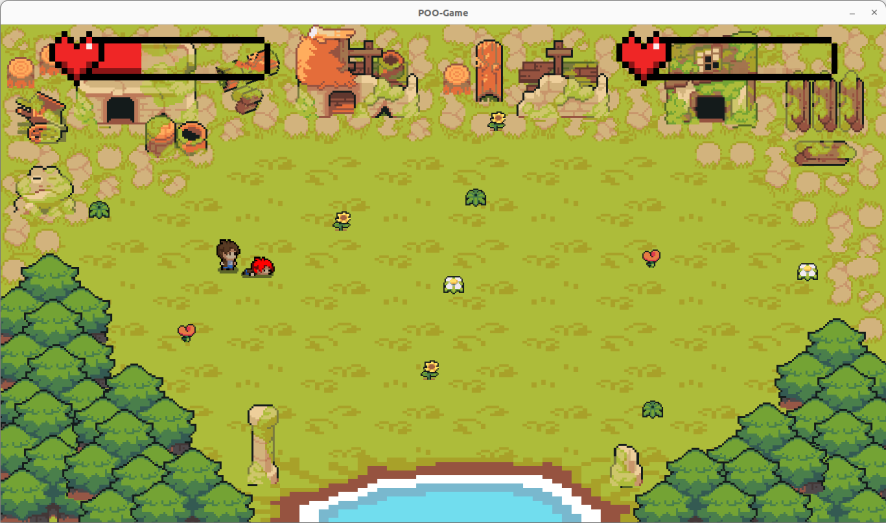

# POO Game



## Project authors
- HAMADY Marie 
- LE LAY Louis
- TEIXEIRA Pierre 

## Libraries and external tools used
- SDL2
- SDL2_mixer
- SDL2_image
- SDL2_ttf
- nlohmann_json

## Compilation and installation instructions

1. Download the necessary libraries using the following commands:
    ```sh
    sudo apt-get install libsdl2-dev libsdl2-ttf-dev libsdl2-image-dev libsdl2-mixer-dev
    sudo apt install nlohmann-json3-dev
    ```

2. Clone the game's Git repository:
    ```sh
    git clone https://github.com/MPL-projects/POO-game.git
    ```

3. Access the project directory:
    ```sh
    cd path/to/the/repository
    ```

4. Compile the game using `make` :
    ```sh
    make
    ```

6. Run the game:
    ```sh
    ./main
    ```

## User manual

### Goal of the game
Two players on the same PC battle it out in an 8-bit game. The aim is for one player to lose all his hit points.

### How to play

- **Default keys:**
  - **Player 1:**
    - Move : 
		- Up: `Z`
		- Down: `S`
		- Right: `D`
		- Left: `Q`
    - Attack: `E`
    - Parry: `R`
  - **Player 2:**
    - Movement: Directional arrows
    - Attack: `M`
    - Parry: `L`

- **With joysticks:**
  - Two possibilities:
	- One joystick player, one keyboard player.
	- Two joystick players.

### Game rules
- Each player starts with 50 life points (HP).
- Each attack inflicts 10 VP of damage on the opponent.
- Each player's VPs are displayed as hit point bars.
- When a player runs out of VPs, he dies and the game offers to restart.

### Initial menu options
- Change each player's skin.
- When a player runs out of VPs, he dies and the game offers to restart the game.

### Initial menu options
- Change each player's skin.
